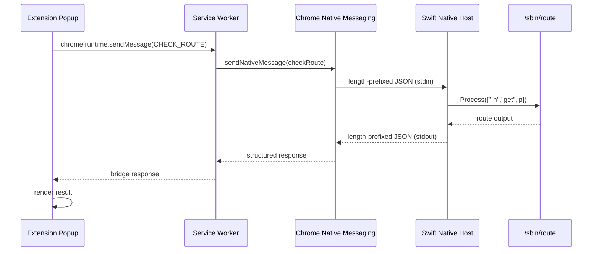

# Architecture

VPN Route Inspector is a local diagnostic stack composed of a Chrome extension and a macOS native host. Milestone 1 implements manual IPv4 route lookup only.

## High-level flow (Milestone 1)



## Components

### Extension popup (`extension/popup/`)

Plain HTML/CSS/JavaScript UI. Collects an IPv4 address, shows loading state, and displays structured success or error results. Does not call Native Messaging directly — it only talks to the service worker.

### Manifest V3 service worker (`extension/service-worker.js`)

Background script registered in `manifest.json`. Receives internal messages from the popup, generates a `requestId`, and calls `chrome.runtime.sendNativeMessage` with host name `com.freemandan.vpn_route_inspector`.

Milestone 1 permissions are limited to `nativeMessaging` only.

### Native Messaging boundary

Chrome launches the native host as a child process and communicates over stdin/stdout using a binary framing protocol:

1. 4-byte little-endian message length
2. UTF-8 JSON payload

See [native-messaging.md](native-messaging.md) for message schemas.

**Security boundary:** only extension origins listed in the installed manifest's `allowed_origins` may invoke the host. The host validates all input before executing system commands.

### Swift native host (`native-host/`)

Executable `vpn-route-host` plus testable core library `VpnRouteHostCore`:

| Module | Responsibility |
|--------|----------------|
| `IPv4Validator` | Reject non-IPv4 input before any system call |
| `RouteCommandExecutor` | Run `/sbin/route` via `Process` (no shell) |
| `RouteOutputParser` | Extract `interface:` from command output |
| `RouteClassifier` | Map interface name to `DIRECT`, `VPN`, or `UNKNOWN` |
| `MessageHandler` | Decode JSON, orchestrate lookup, encode response |
| `NativeMessagingIO` | Framed read/write on stdin/stdout |

All diagnostics and logs go to **stderr**. **stdout** is reserved exclusively for Native Messaging responses.

### Route lookup

The host executes:

```
/sbin/route -n get <validated-ipv4>
```

Arguments are passed as a discrete array to `Process` — never interpolated into a shell command string.

Classification rules:

| Interface prefix | Route type |
|------------------|------------|
| `utun`           | `VPN`      |
| `en`, `bridge`, `pdp_ip` | `DIRECT` |
| other            | `UNKNOWN`  |

## Security boundaries

1. **Input validation** — only validated IPv4 addresses reach `/sbin/route`.
2. **No shell execution** — no `/bin/sh -c`, `system()`, or string-built commands.
3. **Origin allowlist** — installed manifest restricts which extension ID may connect.
4. **Minimal Chrome permissions** — no `<all_urls>` or `webRequest` until request capture is implemented.
5. **No secrets** — the tool does not store credentials, cookies, or browsing history.

## Future request-capture flow (not implemented)

Later milestones will add optional `webRequest` or `declarativeNetRequest` integration to observe requests from the active tab, resolve actual remote IPs, group by domain, and batch route checks. The native host API may gain actions such as `checkRoutes` (batch) while keeping the same security model.


Each milestone remains independently testable before the next layer is added.
