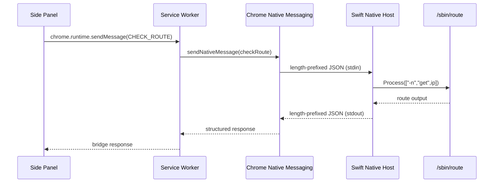
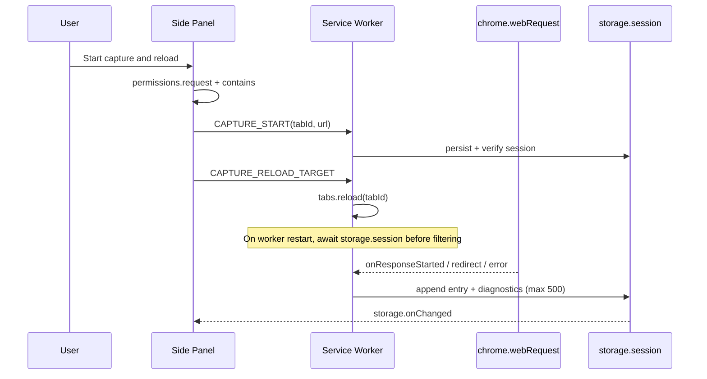
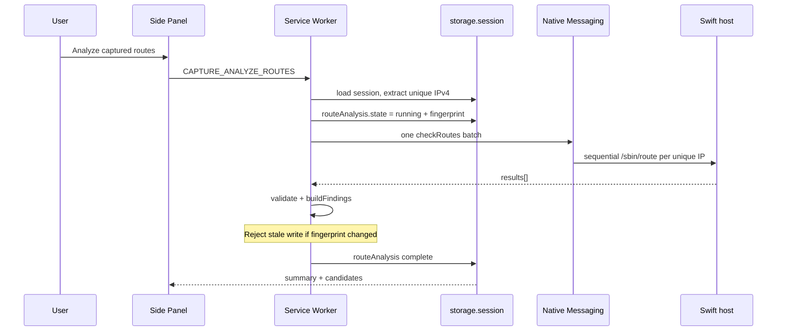

# Architecture

VPN Route Inspector is a local diagnostic stack composed of a Chrome extension and a macOS native host.

- **Milestone 1 (complete):** manual IPv4 route lookup via Native Messaging (`checkRoute`).
- **Milestone 2 (complete):** user-controlled response capture for one HTTP/HTTPS tab via non-blocking `webRequest`, Side Panel UI, `chrome.storage.session`.
- **Milestone 3 (current):** explicit batch route analysis (`checkRoutes`) and pure split-tunnel diagnosis. **No** route check inside webRequest listeners.

## Interpretation boundary

`/sbin/route -n get` reports the **current** macOS route at analysis time. It does not cryptographically prove which route a previously completed TCP/QUIC connection used. Results are strong evidence when Chrome observed a remote IPv4, the current route is VPN, and the capture shows HTTP/network errors — **not** packet capture.

## High-level flow (Milestone 1 — manual route check)

## High-level flow (Milestone 2 — active-tab capture)

## High-level flow (Milestone 3 — batch route analysis)

## Components

### Extension Side Panel (`extension/sidepanel/`)

Primary UI. Product priority:

1. Capture controls
2. **Route analysis** summary / Problematic routes / hostname–IP groups / Copy candidate IPs
3. Raw captured responses (collapsible, secondary)
4. Manual tools (collapsible single-IP checker)

Captured and analysis values use `createElement` / `textContent`. Current-route snapshot warning is shown near analysis results.

### Pure logic (`extension/capture-core.js`)

Shared by the service worker and JavaScriptCore tests. Owns capture session normalization, unique IPv4 extraction, hostname→IP aggregation, finding categories, candidate exclusion ordering, fingerprints, and stale-state helpers. Diagnostic business rules must not live only in DOM code.

### Manifest V3 service worker (`extension/service-worker.js`)

| Action | Purpose |
|--------|---------|
| `CHECK_ROUTE` | Single-IP native lookup (Milestone 1, unchanged) |
| `CAPTURE_*` | Start/stop/clear/revoke/get state (Milestone 2) |
| `CAPTURE_ANALYZE_ROUTES` | One `checkRoutes` batch + diagnosis (Milestone 3) |
| `CAPTURE_EXPORT_REPORT` | Privacy-reduced Markdown diagnostic report |
| `CAPTURE_EXPORT_JSON` | Full technical JSON (explicit advanced export) |

`webRequest` listeners never call the native host. Only one analysis may run at a time (`ALREADY_ANALYZING`).

Diagnostic Markdown is privacy-reduced (no query/fragment/userinfo; aggregated evidence; 100k character cap). Full JSON may include path/query URL data and must never be generated automatically. Exports are clipboard-only — never uploaded.

### Native host (`native-host/`)

| Module | Responsibility |
|--------|----------------|
| `IPv4Validator` | Reject non-IPv4 before any system call |
| `RouteCommandExecutor` | `/sbin/route` via `Process` (no shell) |
| `RouteOutputParser` | Extract `interface:` |
| `RouteClassifier` | `DIRECT` / `VPN` / `UNKNOWN` |
| `NativeMessagingFraming` | Length-prefix encode/decode |
| `MessageHandler` | `checkRoute` + `checkRoutes` (shared `lookupRouteItem`) |

Batch rules: validate size before Process; sequential lookups; dedupe valid IPv4s; per-item errors; no raw route stdout/stderr in responses; max 128 input items.

### Testing

- Swift Testing via `swift test` (only path).
- Capture/analysis: `/System/Library/Frameworks/JavaScriptCore.framework/.../jsc extension/tests/run-capture-core-tests.js`.

## Security and privacy boundaries

1. Validate all Native Messaging input before `/sbin/route`.
2. No shell execution; discrete `Process` argument arrays only.
3. Single stable extension origin in `allowed_origins`.
4. Optional HTTP/HTTPS hosts only; no permanent `<all_urls>`; no `webRequestBlocking`.
5. Metadata only — no bodies, cookies, authorization, or full headers.
6. Session memory only (`chrome.storage.session`).
7. Never recommend DIRECT / UNKNOWN / no-IP / IPv6 as exclusion candidates.
8. Do not equate a current route snapshot with packet capture.
9. Preserve the committed extension public `key`.
