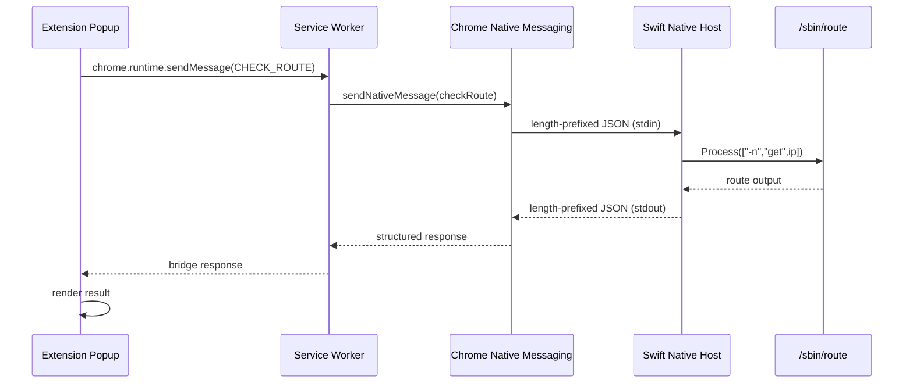
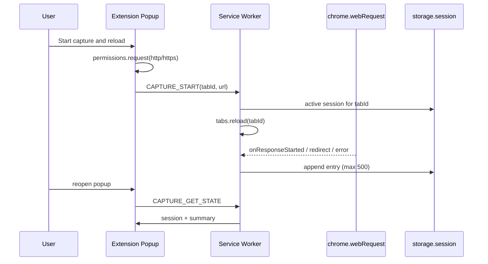
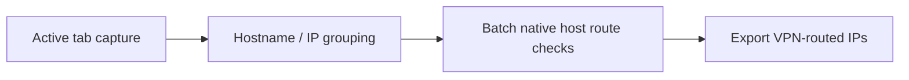

# Architecture

VPN Route Inspector is a local diagnostic stack composed of a Chrome extension and a macOS native host.

- **Milestone 1 (complete):** manual IPv4 route lookup via Native Messaging.
- **Milestone 2 (current):** user-controlled response capture for one HTTP/HTTPS tab via non-blocking `webRequest`. Captured IPs are **not** auto route-checked yet.

## High-level flow (Milestone 1 — manual route check)



## High-level flow (Milestone 2 — active-tab capture)



## Components

### Extension popup (`extension/popup/`)

Plain HTML/CSS/JavaScript UI with two sections:

1. **Manual route check** — IPv4 input → service worker → native host (Milestone 1).
2. **Active tab capture** — start/stop/clear/revoke; renders session metadata and a scrollable result list (Milestone 2).

The popup never calls Native Messaging directly. Capture rows are built with `createElement` / `textContent` (no unrestricted `innerHTML` of captured strings).

Optional HTTP/HTTPS host access is requested **only** from the **Start capture and reload** click handler so the prompt stays tied to a user gesture. Opening the popup does not request permissions. `activeTab` alone does **not** expose all cross-origin subresources; optional host access is required for CDN/API observation.

### Manifest V3 service worker (`extension/service-worker.js`)

Background script registered in `manifest.json`. Responsibilities:

| Action | Purpose |
|--------|---------|
| `CHECK_ROUTE` | Forward IPv4 lookup to the native host (unchanged) |
| `CAPTURE_GET_STATE` | Return session + counters |
| `CAPTURE_START` | Bind to one validated tab, then reload it |
| `CAPTURE_STOP` | Stop appending entries |
| `CAPTURE_CLEAR` | Clear entries |
| `CAPTURE_REVOKE_HOSTS` | Stop, clear, remove optional origins |

`webRequest` listeners (`onResponseStarted`, `onBeforeRedirect`, `onErrorOccurred`) are registered **synchronously at top level**. They filter on the stored numeric tab ID. The remote IP is Chrome’s `details.ip` when present — **not** DNS. IP may be missing or IPv6.

Capture sessions are stored only in `chrome.storage.session` (schemaVersion 1, max **500** entries, oldest evicted). Storage updates are serialized through a Promise queue. Data is not persisted across browser/extension restarts and is not exposed to content scripts (none are used).

### Native Messaging boundary

Chrome launches the native host as a child process and communicates over stdin/stdout using a binary framing protocol:

1. 4-byte little-endian message length
2. UTF-8 JSON payload

See [native-messaging.md](native-messaging.md) for message schemas. Milestone 2 does **not** change framing or the Swift API.

**Security boundary:** only the single stable extension origin listed in the installed manifest's `allowed_origins` may invoke the host (derived from the committed `key` in `extension/manifest.json` — no wildcards). The host validates all input before executing system commands.

### Swift native host (`native-host/`)

Executable `vpn-route-host` plus testable core library `VpnRouteHostCore`:

| Module | Responsibility |
|--------|----------------|
| `IPv4Validator` | Reject non-IPv4 input before any system call |
| `RouteCommandExecutor` | Run `/sbin/route` via `Process` (no shell) |
| `RouteOutputParser` | Extract `interface:` from command output |
| `RouteClassifier` | Map interface name to `DIRECT`, `VPN`, or `UNKNOWN` |
| `NativeMessagingFraming` | Little-endian length-prefix encode/decode |
| `MessageHandler` | Decode JSON, orchestrate lookup, encode response |

All diagnostics and logs go to **stderr**. **stdout** is reserved exclusively for Native Messaging framed responses.

The canonical release artifact is `native-host/dist/vpn-route-host`, produced only by SwiftPM via `./scripts/build-host.sh`.

### Testing

Unit tests live under `native-host/Tests/` and use **Swift Testing** (`import Testing`) supplied by the Swift 6.1+ toolchain. They run only through SwiftPM:

```bash
cd native-host && swift test
```

Full Xcode is not required; Xcode Command Line Tools with Swift 6.1 or newer are sufficient. There is no XCTest dependency and no fallback test runner. A failed test makes the build fail visibly (`./scripts/build-host.sh` runs `swift test` before the release build). Minimum supported platform is macOS 13.

### Route lookup

The host executes:

```
/sbin/route -n get <validated-ipv4>
```

Arguments are passed as a discrete array to `Process` — never interpolated into a shell command string.

Classification rules:

| Interface prefix | Route type |
|------------------|------------|
| `utun`           | `VPN`      |
| `en`, `bridge`, `pdp_ip` | `DIRECT` |
| other            | `UNKNOWN`  |

## Security and privacy boundaries

1. **Input validation** — only validated IPv4 addresses reach `/sbin/route`.
2. **No shell execution** — no `/bin/sh -c`, `system()`, or string-built commands.
3. **Origin allowlist** — installed Native Messaging manifest restricts connection to the single stable project extension ID. No wildcards. Private PEM is outside the repository.
4. **Optional host access** — HTTP/HTTPS observation uses `optional_host_permissions` only; requested after explicit user action. No permanent `host_permissions` / `<all_urls>`. No `webRequestBlocking`.
5. **Capture scope** — one selected tab ID; metadata only (no bodies, headers, cookies, authorization). URLs may still contain path/query data — capture is for intentional diagnostics.
6. **Session memory only** — captures live in `chrome.storage.session` and clear on browser/extension restart. Nothing is sent outside the local extension except the existing manual native route-check path.
7. **Stable key** — do not remove or regenerate the committed extension public `key`.

## Future flow (batch route checks — not implemented)

Later milestones will classify captured IPs via the native host in batch. `declarativeNetRequest` alone is **not** a substitute when the goal is collecting the actual remote IP Chrome connected to. Do **not** call the native host from every webRequest listener.



Each milestone remains independently testable before the next layer is added.
